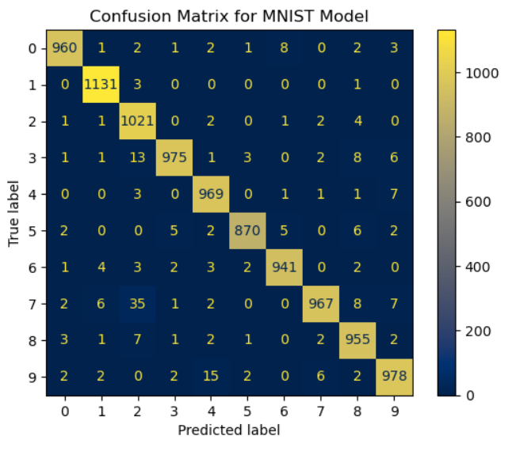
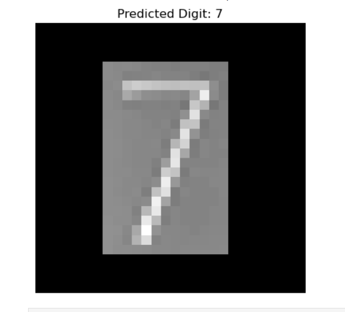

# MNIST Digit Classifier with ANN

## Objective
This project builds an end-to-end artificial neural network (ANN) to classify handwritten digits from the MNIST dataset. It includes data preprocessing, model training with a multi-layer perceptron, evaluation using accuracy and confusion matrix, and prediction on custom digit images with preprocessing. The project demonstrates practical implementation of deep learning for image classification and hands-on experience in model evaluation and visualization.

### Skills Learned

- Loaded and explored the MNIST handwritten digit dataset to understand data structure and class distribution.
- Applied data preprocessing techniques including normalization, flattening image data, and one-hot encoding of labels.
- Designed and trained a multi-layer Artificial Neural Network (ANN) using TensorFlow and Keras.
- Evaluated model performance using accuracy and confusion matrix visualization.
- Implemented custom image preprocessing and prediction to classify external handwritten digit images, gaining hands-on experience in end-to-end deep learning workflow.
  
### Tools and Packages Used

- **Python** for data processing, model development, and implementation
- **NumPy** for numerical computations and array operations
- **TensorFlow / Keras** for building and training the Artificial Neural Network (ANN)
- **Matplotlib** for visualization, including confusion matrix and predictions
- **Scikit-learn** for model evaluation metrics and confusion matrix generation
- **PIL (Pillow)** for image preprocessing and handling custom digit images
- **Jupyter Notebook** for development, experimentation, and analysis.

## Steps

### 1. Data Collection and Loading

The MNIST handwritten digit dataset was loaded using TensorFlow’s built-in dataset utility. It contains grayscale images of digits (0–9) split into training and testing sets. Each image has a resolution of 28×28 pixels. Initial inspection helped understand the data shape and class distribution.

### 2. Data Preprocessing

The image data was flattened from 28×28 pixels into 784-dimensional vectors to make it suitable for an Artificial Neural Network. Pixel values were normalized to the range 0–1 for faster convergence during training. The target labels were one-hot encoded to support multi-class classification. These preprocessing steps ensured the data was properly formatted for model training.

### 3. Model Building

A multi-layer Artificial Neural Network (ANN) was built using the Keras Sequential API. The architecture consisted of multiple fully connected (Dense) layers with ReLU activation to learn complex patterns. A Softmax layer was used in the output to classify digits into one of ten classes. This structure enabled effective learning from image data.

### 4. Model Compilation and Training

The model was compiled using the Adam optimizer and categorical cross-entropy loss function. Accuracy was used as the evaluation metric to measure classification performance. The model was trained for multiple epochs with a validation split to monitor learning progress. This step helped the network generalize better and avoid overfitting.

### 5. Model Evaluation

The trained model was evaluated on the unseen test dataset to measure its performance. Test accuracy provided insight into how well the model generalized to new data. Predictions were generated for the test set and compared against true labels. This evaluation validated the effectiveness of the trained ANN.

### 6. Confusion Matrix Analysis

A confusion matrix was generated using Scikit-learn to analyze classification results in detail. It provided a class-wise breakdown of correct and incorrect predictions. Visualization of the confusion matrix helped identify patterns of misclassification. This step enhanced interpretability of the model’s performance.

*Ref 1: Model Performance – Confusion Matrix*

### 7. Custom Image Prediction and Visualization

A preprocessing function was implemented to handle external handwritten digit images. The images were converted to grayscale, resized, normalized, and reshaped to match the MNIST input format. The trained model was then used to predict the digit from the custom image. The processed image and predicted label were visualized for better understanding.

*Ref 2: Model Prediction on Custom Handwritten Digit*

This output visualizes the model’s prediction on a preprocessed custom handwritten digit image.

